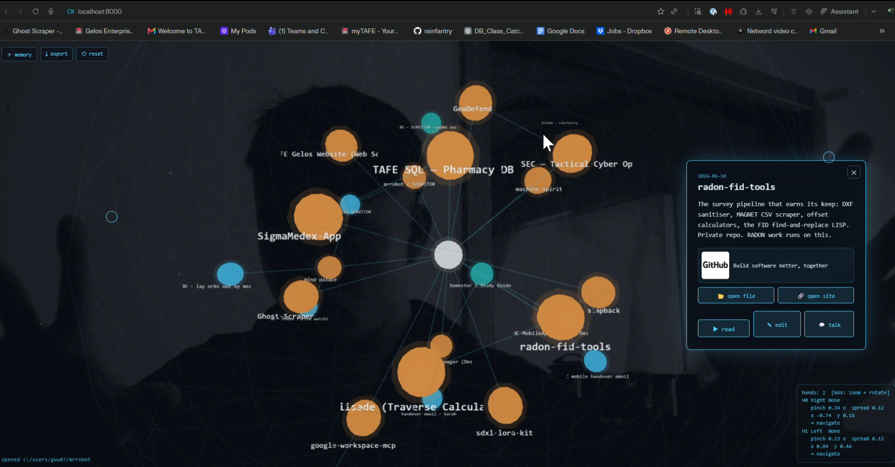
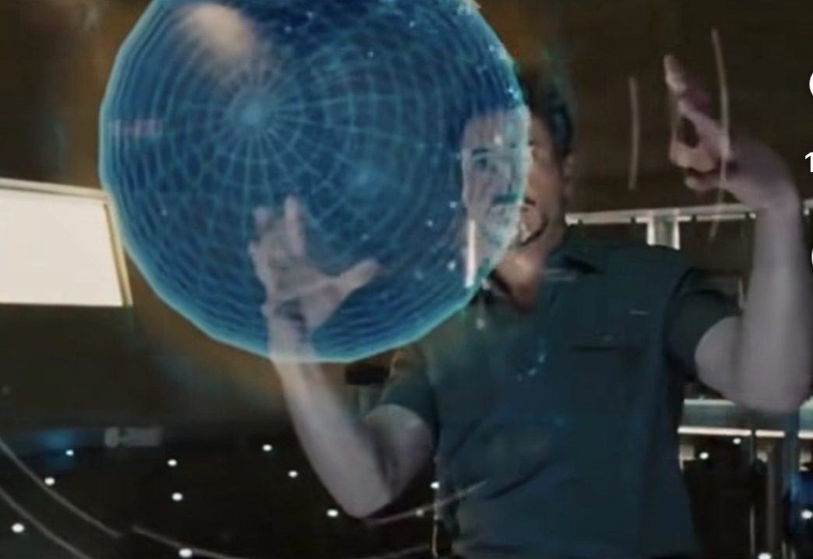

# MIND PALACE

<p align="center">
  
  <br><sub><b>Real — the Mind Palace, running in a browser.</b></sub>
</p>

<p align="center">
  
  <br><sub><b>The dream it's chasing.</b></sub>
</p>

A gesture-driven 3D interface to a personal memory graph. Wave your hand at the
webcam, reach into a constellation of your own memories floating in space, **pinch**
one to drag it around, flash **two fingers** (a peace sign) to pop it open and hear it
read back in your own cloned voice — or talk to a local AI about it.

This is a learning project. It's deliberately built with **no framework and no build
step** so every moving part is visible and hackable. This README explains how it's
put together, not just what it does.


---

## Run it

The webcam needs a real server (`file://` can't touch the camera or load modules):

```bash
cd mind-palace
python server.py                # or double-click serve.bat on Windows
```

Open **http://localhost:8000** in Chrome/Edge and allow the camera.

`server.py` is a tiny stdlib server — no pip, no build step. It serves the files
*and* adds the two endpoints the "open a linked file / show a site preview"
feature needs (`/open`, `/preview`). It binds to `127.0.0.1` only, on purpose:
`/open` launches things on your machine, so it must never be reachable off the box.

## Controls

| Do this | Get this |
|---------|----------|
| **Point** (index finger) | crosshair tracks your fingertip — and **brushes / knocks** orbs it passes through, like a physics object |
| **Pinch + hold** (thumb + index) | grab and drag an orb (linked cluster follows). A quick **pinch-tap** selects it: card + read |
| **Two fingers** (index + middle V) | expand it: card opens + read aloud |
| **Open palm** + move | orbit the whole force-sphere of nodes |
| **Two hands** | navigate the sphere — spread/close = **zoom**, move together = **rotate**, twist = roll |
| **Mouse fallback** | move = point, hold-left = drag, quick-click = select, right-click = open |

Bottom-right is a **live detection readout** — per hand it shows handedness,
gesture, pinch distance, fingertip coords and what it's doing. That's your window
into what the tracker actually sees.

---

## How it works (the architecture)

### The one big idea

Everything hangs off **one data structure: a graph of memory nodes**. A node is just:

```json
{ "id": "servitor", "date": "2026-05", "title": "…", "body": "…",
  "tag": "build", "links": ["voice-clone", "node-twin"],
  "path": "C:\\…\\folder", "url": "https://…" }
```

`links` are edges to other nodes. `path` and `url` are optional — a file/folder on
disk or a website the node points at, openable from its card. That's the whole model. Orbs, lines, the physics,
the voice, the AI chat — all of it is just different ways of looking at, or acting
on, that list of nodes.

### No build step, on purpose

It's plain **ES modules** loaded straight in the browser, with `three.js` pulled from
a CDN via an `importmap` in `index.html`. No npm, no bundler, no transpile. You edit a
file, refresh, done. The cost is you can't use bare `npm install` packages; the win is
there's nothing hidden between you and the running code.

### The pipeline, end to end

```
webcam ─▶ hands.js ─▶ interaction.js ─▶ scene/nodes/graph (the 3D) ─▶ screen
                            │
                            ├─▶ voice.js   (read a memory aloud)
                            ├─▶ agent.js   (talk to a local model about it)
                            └─▶ ui.js      (card / editor / chat panels)
```

1. **`hands.js`** runs MediaPipe's Gesture Recognizer on each webcam frame and spits
   out, per hand: a cursor (your fingertip in 3D-screen coords), whether you're
   pinching, the pinch distance, and the named gesture (open palm, fist, …). No
   camera? It quietly falls back to the mouse with the same data shape, so nothing
   downstream knows the difference.

2. **`interaction.js`** is the glue. It takes that per-hand data and decides what
   happens: raycasts your cursor into the 3D scene to find the orb under it, grabs on
   pinch, drags while held, and expands (opens + reads) when you open your fingers.

3. **`scene.js` / `nodes.js` / `graph.js`** are the 3D:
   - `scene.js` — the three.js world (camera, lights, stars, render loop).
   - `nodes.js` — turns each memory into a glowing orb + floating label.
   - `graph.js` — draws the edges and runs a tiny **force simulation** with
     *structure*: the **persona/subject node is pinned at the centre** as the radial
     anchor, and **each category gets its own sector on the sphere**, so nodes group
     with their own kind instead of floating randomly. Springs (links) and repulsion
     shape the detail inside each group. Grab or brush an orb and it gets shoved; the
     sim re-settles it back into its group. Same idea as a d3 force graph, hand-rolled
     so you can see every line of it.

4. **`voice.js`** reads a memory aloud. If `js/voice.local.js` (gitignored) holds an
   ElevenLabs key + voice ID, it's your cloned voice; otherwise it's the browser's
   built-in speech. A `speaking` lock means a memory reads **once per selection** and
   won't stack or restart until the loop finishes.

5. **`agent.js`** sends a memory + your question to a **local** model (Ollama, e.g.
   qwen-code) and reads the reply back. Settings live in `agent.config.js`.

6. **`ui.js`** owns the DOM panels — the memory card (view / edit / talk), the
   toolbar, the status line and the readout. The mouse editor (`editor.js`) adds,
   edits and deletes nodes, including a searchable link picker that draws new edges.

### Where the data comes from (three layers)

`memories.js` merges three sources, each overriding the last by `id`:

1. `data/memories.json` — the public seed (safe stuff, committed)
2. `data/memories.local.json` — your real archive (**gitignored**, optional)
3. `localStorage` — edits you make in the browser (via `store.js`)

So the public repo only ever ships safe demo data; your real history and any keys
stay on your machine.

If your local file sets `"replaceSeed": true` at the top level, the demo seed is
dropped entirely and **only your own graph shows** — handy when you've turned the
palace into a real working board and don't want the sample nodes cluttering it.

### The "seams" (where bigger pieces plug in later)

Two files are written as swappable seams:
- `voice.js` — swap the ElevenLabs call for any TTS and the rest doesn't care.
- `agent.js` — swap the Ollama call for the real SERVITOR/Hermes endpoint, same
  `ask()` signature.

That's how the other "twin" pieces (the face clone, the agent, eventually survey
data) attach without rewrites.

---

## File map

```
server.py               local server: static + /open + /preview — run THIS
index.html              entry + importmap + all the DOM
css/style.css           all styling
data/memories.json      public seed
js/main.js              boot + wiring — START HERE
js/memories.js          load/merge data (seed / local / localStorage)
js/store.js             localStorage persistence
js/scene.js             three.js world
js/nodes.js             memories → orbs
js/graph.js             edges + force simulation
js/hands.js             webcam → cursor/pinch/gesture (+ mouse fallback)
js/interaction.js       hand → orb behaviour (grab/drag/expand)
js/voice.js             text-to-speech (cloned voice / browser)
js/agent.js             local-model chat
js/agent.config.js      local-model settings
js/editor.js            add/edit/delete memories
js/resource.js          open a node's linked file/folder or URL
js/ui.js                card / toolbar / chat DOM controller
docs/                   ARCHITECTURE / CODEPLAN / HANDOFF
```

## Editing & adding memories

`＋ memory` (top-left) adds a node. Open any memory → `✎ edit` to change its
title/body/tag, and **search-and-click other memories in the link box** to connect
them (the edge lines draw themselves). `⤓ export` copies the whole graph as JSON to
paste into `data/memories.local.json`. Edits auto-save to your browser.

`⟲ reset` wipes those in-browser edits (localStorage) and reloads straight from the
data files. Reach for it if the graph seems "stuck" showing old nodes after you've
changed `memories.local.json` — localStorage is the top layer, so an old saved
snapshot there overrides your files and outlives a normal refresh. Reset dumps the
old copy to the console first, so nothing's truly lost.

## Linking files & sites to a memory

A memory can point at a real **file or folder on your machine** and/or a **website**.
In `✎ edit`, fill the **file / folder path** and/or **url** fields and save. The card
then shows an **open section**:

- **📂 open file** — opens the path in Explorer (a folder) or its default app (a file).
  A browser can't do that itself, so `server.py`'s `/open` endpoint does it for it —
  which is why you run `server.py`, not plain `http.server`.
- **🔗 open site** — opens the URL in your default browser (through the same helper,
  not `window.open` — so a *pinch* can't be popup-blocked), and shows a little
  **preview tile** (title + thumbnail) fetched server-side via `/preview` (so CORS /
  frame-blocking doesn't bite).

Both buttons are **pinch-able**: with the webcam on, put your fingertip on one and
pinch — it fires while the pinch is held over the button, so a slightly jittery aim
still lands. Hands never have to leave the air.

The path/url live on the node like any other field, so they ride along in export and
stay in whichever data layer you saved them to (your gitignored local archive stays private).

## Cloned voice & local model

- **Voice:** copy `js/voice.local.example.js` → `js/voice.local.js`, drop in your
  ElevenLabs key + voice ID. Gitignored; never committed. Without it, browser voice.
- **Local model:** runs against Ollama. Start it so the browser is allowed:
  ```powershell
  $env:OLLAMA_ORIGINS="*"; ollama serve
  ollama pull qwen2.5-coder
  ```
  Model/system-prompt/temperature in `js/agent.config.js` (or a gitignored
  `js/agent.local.js` override).

## Docs

- `docs/ARCHITECTURE.md` — deeper architecture notes
- `docs/CODEPLAN.md` — build phases + what's next (the 3D face is Phase F)
- `docs/HANDOFF.md` — pick-up guide for an AI agent / a different model

## Stack

three.js · MediaPipe Tasks Vision (gesture recognizer) · ElevenLabs · Ollama ·
Web Speech API · vanilla ES modules, no build step.
